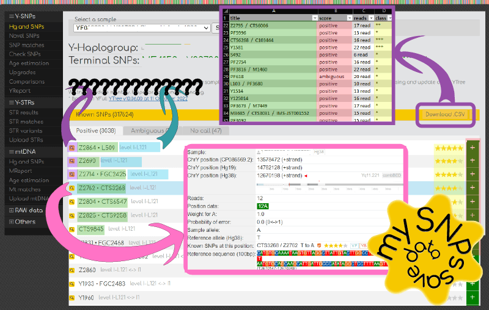

# save-my-data-from-yfull.com

# The concept.

## 1) Saveing information about our **SNP**s.



> The save button given from the YFull team, is very helpful, but it allows you to save a modest amount of information, while manually collecting information about your polymorphisms-single-nucleotide can take a lot of time and does not provide the assurance of no mistakes, in this tedious process.

```json
{
  position: {
    length: 1,
    gBanding: 'Yp11.2'
    hg38: 5798214,
    hg19: 5666255,
    hs1: 5478236,
  },
  refSeq_Hg38:[
    'TTTCATCTTCACACTCTGTGCTTAGTTGTACCCAACATTCTTGGGAAAGC',
    'T',
    'CTCAACATATTCAAAAATACTTGATTGTTGTAATCTTAGCTGCATGTGCA'
  ],
  myAllele:{
    reads: 15,
    allele:'K (G or T)',
    data: [
      { allele:'T', reads:4, weight:0.27977315689981097 },
      { allele:'G', reads:11, weight:0.720226843100189 }
    ],
    probabilityOfError: 0.311447788310899
  },
  atThisPosition:[
    {SNP: 'Y1941 • FGC2485', mutation: 'T to G', sanger:{test:1, positive:0}, raiting:['****',2], database:['YFull','YBrwser']}
  ]
}
```
